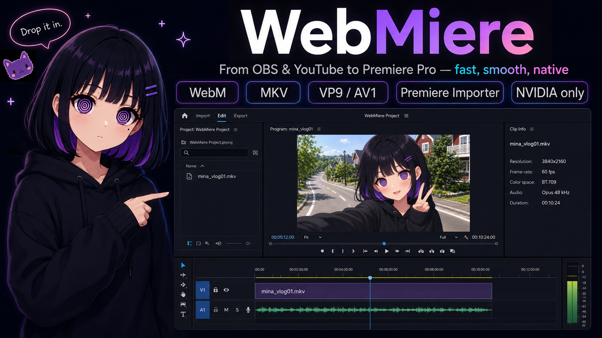

<p align="center">
  
</p>

# WebMiere

**Drop OBS recordings and YouTube-style WebM/MKV media straight into Adobe Premiere Pro.**

WebMiere is a native Windows x64 importer for supported OBS multi-track Matroska recordings and YouTube-style `.webm`/`.mkv` media, provided the files match its documented media requirements.

Import VP9 or AV1 video with up to six independent Opus stereo tracks, exposed separately in Premiere Pro.

**No ProRes transcode. No proxy prep. No WAV extraction.**

Import the file, drop it on the timeline, and start editing.

Demo: [Watch on YouTube](https://www.youtube.com/watch?v=lo9j_QIbcrg)

## System Requirements
|  | VP9 | AV1 |
| :--- | :--- | :--- |
| **Platform** | Windows x64 / NVIDIA | Windows x64 / NVIDIA |
| **GPU** | **RTX 20 Series or Newer**<br><sub>Recommended</sub> | **RTX 30 Series or Newer**<br><sub>Required</sub> |
| **Host** | Adobe Premiere Pro 26.x | Adobe Premiere Pro 26.x |
| **Not Supported** | AMD-only, Intel-only, macOS | AMD-only, Intel-only, macOS |

## What WebMiere Does

- Directly imports supported OBS Matroska recordings containing AV1 Main video and up to six independent Opus stereo tracks
- Exposes each audio stream as a separate stereo track in Premiere Pro
- Handles YouTube-style VP9/Opus and AV1 SDR/Opus WebM/MKV without video transcoding, proxy preparation, or separate WAV extraction
- Uses NVIDIA NVDEC, CUDA, and NPP for accelerated video decoding
- Prioritizes responsive timeline editing over broad format compatibility

Typical workflows:

```text
Supported OBS AV1 MKV + up to six Opus tracks -> Premiere Pro -> edit
YouTube-style VP9 or AV1 WebM/MKV + Opus -> Premiere Pro -> edit
```

WebMiere is deliberately specialized. It is not a universal OBS or Matroska importer.

## Supported Media

| Feature | Specification |
| :--- | :--- |
| **Source** | Supported OBS recordings and YouTube-style WebM/MKV media |
| **Containers** | WebM / Matroska (`.webm`, `.mkv`) |
| **Video** | VP9 Profile 0 / AV1 Main SDR |
| **Pixel Format** | 8-bit YUV 4:2:0 |
| **Color** | SDR, BT.709 matrix, limited range |
| **Frame Rate** | Constant frame rate |
| **Maximum Dimensions** | 8192 × 4320 |
| **Audio Codec** | Opus |
| **Audio Streams** | None, or 1–6 independent streams |
| **Audio Format** | Stereo, 48 kHz per stream |
| **Premiere Output** | Separate stereo audio tracks |

Video-only files remain supported.

## OBS Multi-Track Recordings

WebMiere can import supported OBS Matroska recordings containing AV1 Main video and up to six independent Opus stereo audio tracks.

Each audio stream is exposed as a separate stereo track in Premiere Pro, in the same order in which it appears in the Matroska container.

Recommended OBS recording properties:

> **Note:** NVIDIA NVENC AV1 recording in OBS requires a GeForce RTX 40 Series GPU or newer.

- Output mode: Advanced
- Recording format: Matroska Video (`.mkv`)
- Video encoder: NVIDIA NVENC AV1
- Profile: Main
- Frame rate: Constant frame rate
- Color format: NV12 (8-bit, 4:2:0)
- Color space: Rec. 709
- Color range: Limited
- Audio encoder: FFmpeg Opus
- Sample rate: 48 kHz
- Channels: Stereo
- Enabled audio tracks: 1–6

Assign sources to recording tracks through OBS Advanced Audio Properties. For example:

- Track 1: complete mix
- Track 2: microphone
- Track 3: desktop or game audio
- Track 4: voice chat
- Track 5: music
- Track 6: auxiliary source

This is an example, not a required layout. Track contents are user-defined. WebMiere does not distribute an OBS profile or scene collection; this section provides setup guidance only.

## YouTube-Style Media and Frame Rate

WebMiere is designed for the ordinary CFR VP9 and AV1 SDR delivery streams commonly encountered in YouTube-style media.

In the media tested so far, YouTube delivery streams have been CFR. True VFR remains outside this plugin's scope.

## Validation

- Six-track routing and long-duration synchronization were verified against direct FFmpeg decoding using an approximately 15-minute recording and a recording longer than three hours.
- No measurable audio drift was observed in the tested recordings.
- Existing single-track AV1 SDR/Opus editing and export behavior was also revalidated.

## Unsupported Media

- True variable-frame-rate video
- VP9 or AV1 10-bit or 12-bit video
- VP9 or AV1 4:2:2, 4:4:4, RGB, or alpha
- HDR, BT.2020, PQ, or HLG media, including AV1 HDR media
- Full-range video
- H.264, HEVC, ProRes, and other non-VP9/non-AV1 video codecs
- More than six audio streams
- AAC, Vorbis, and other audio codecs besides Opus
- Mixed audio sample rates or channel counts, or any sample rate other than 48 kHz
- Mono, surround, or other multichannel audio
- Audio streams with different start times

Unsupported files containing multiple audio streams are rejected as a whole rather than partially imported.

## Installation

1. Install or update the NVIDIA graphics driver.
2. Close Adobe Premiere Pro.
3. Launch `WebMiere-Setup.exe`.
4. Choose `Install`.
5. When Windows asks for permission, allow the WebMiere Worker installer to make changes.
6. Start Premiere Pro.

Default installation path:

```text
C:\Program Files\Adobe\Common\Plug-ins\7.0\MediaCore\WebMiere
```

The installed WebMiere directory must contain `WebMiere.prm` and the matching `ffmpeg` and `nvidia` runtime subdirectories supplied with that release. Do not mix FFmpeg, CUDA, or NPP files from different WebMiere builds.

A typical installed directory contains:

```text
WebMiere.prm
assets\
  WebMiere-App.ico
  licenses\
    ARTWORK_POLICY.md
    README.md
    WebMiere-MPL-2.0.txt
    FFmpeg-COPYING.LGPLv3.txt
    FFmpeg-COPYING.GPLv3.txt
    dav1d-COPYING.BSD-2-Clause.txt
    nv-codec-headers-MIT.txt
    NVIDIA-CUDA-Toolkit-12.9-EULA.txt
    Microsoft-Visual-Cpp-Redistributable.txt
    THIRD_PARTY_NOTICES.md
ffmpeg\
  avcodec-62.dll
  avformat-62.dll
  avutil-60.dll
  swscale-9.dll
  swresample-6.dll
nvidia\
  cudart64_12.dll
  nppc64_12.dll
  nppicc64_12.dll
  nppidei64_12.dll
  nppig64_12.dll
```

Driver-provided NVIDIA components such as `nvcuda.dll` are not bundled with WebMiere.

Standard Inno Setup logs are written to the Windows temporary directory. These are installer logs, not WebMiere importer runtime logs.

### Uninstall

1. Close Premiere Pro.
2. Launch `WebMiere-Setup.exe` and choose `Uninstall`, or uninstall WebMiere from Windows Apps / Installed apps.
3. Restart Premiere Pro.

## Release Integrity and Source Availability

Official release assets should be used as a matched set.

An official release includes:

- A SHA-256 manifest for the downloadable WebMiere package
- The corresponding WebMiere source tag or source archive under MPL-2.0
- The exact FFmpeg runtime build used by the plugin
- A compact installed license payload under `assets\licenses`
- The matching WebMiere FFmpeg runtime and development release packages, including:
  - corresponding FFmpeg source archives
  - corresponding nv-codec-headers source archives
  - corresponding dav1d source archives
  - configure records
  - license records
  - runtime probe report
  - source-change diff
  - SHA-256 manifests
- Third-party license texts and notices applicable to the shipped binaries, including the NVIDIA CUDA Toolkit 12.9 EULA used for this build
- GitHub Artifact Attestations where supported by the public release workflow

The FFmpeg build recipe, corresponding source archives, and provenance records for this build are provided by the fixed [WebMiere FFmpeg factory Release](https://github.com/KawaiiEngine/WebMiere-FFmpeg/releases/tag/ffmpeg-webmiere-8.1.2-4).

Review `THIRD_PARTY_NOTICES.md` and the licenses of the exact runtime DLLs before redistributing a package.

## Troubleshooting

### WebMiere Does Not Appear in Premiere

- Confirm that the system has a supported NVIDIA GPU.
- Install a compatible NVIDIA graphics driver.
- Confirm that `WebMiere.prm`, `ffmpeg`, and `nvidia` are present in the same `WebMiere` directory.
- Confirm that the FFmpeg DLLs are in `WebMiere\ffmpeg` and the CUDA/NPP DLLs are in `WebMiere\nvidia`.
- Install the Microsoft Visual C++ 2015-2022 Redistributable for x64.
- Fully restart Premiere Pro.
- Check the Windows temporary directory for the standard Inno Setup installer log if installation failed.
- Check Premiere's plugin loading log or use Process Monitor to identify a missing DLL if installation succeeded but the importer does not load.

WebMiere links directly against the NVIDIA driver API; runtime DLLs are preloaded at importer startup. If a required DLL is missing, WebMiere safely refuses to initialize (see [NVIDIA Loading Model](#nvidia-loading-model) below).

### A File Does Not Import

A `.webm` or `.mkv` extension does not guarantee compatibility. Compare the file against these requirements:

- **Codec:** VP9 Profile 0 or AV1 Main SDR
- **Frame rate:** Constant frame rate rather than true VFR
- **Pixel format:** 8-bit YUV 4:2:0
- **Color:** SDR, BT.709 matrix, limited range
- **AV1 hardware:** For normal AV1 use, the system has an NVIDIA GPU with AV1 hardware decode support
- **Audio:** Video-only, or one to six independent Opus stereo streams at 48 kHz
- **Audio timing:** All enabled audio streams use the same format and begin at the same source time
- **File integrity:** Fully downloaded and not truncated

For systems without NVIDIA AV1 hardware decode support, use VP9/Opus media instead of AV1/Opus.

If another importer is installed, WebMiere is designed to take supported VP9/Opus and AV1 SDR/Opus media and pass unsupported media back to Premiere so another importer can handle it.

If a YouTube download that should be supported does not import, download it again before investigating further. Incomplete downloads and unusual remuxing tools can produce files outside the normal supported YouTube-style VP9/Opus or AV1 SDR/Opus shape.

## Known Behavior and Design Choices

- WebMiere favors responsive editing over strict recovery. Short audio reads and some recoverable audio decode gaps may be padded with silence.
- Audio timing is normalized relative to the shared source start time. Small startup residues are handled at the beginning of each stream rather than allowed to become progressive audio drift.
- YouTube/DASH muxing may produce small differences between video and audio end times. When a stream-specific duration is unavailable, a container-duration fallback can result in a short final-frame hold. This has not shown a visible problem in normal tested YouTube material.
- True VFR files may be accepted as nominal CFR without exact timestamp reconstruction; frames may be selected, repeated, or skipped without a warning (see [Media Contract](#media-contract)).
- Premiere may occasionally request BGRA output for thumbnails, isolated frames, effects, or internal display paths. This is expected; normal playback generally uses YUV420P when available.

# Technical Notes

## Architecture

WebMiere is a Premiere importer plugin. Its exported entry point is `xImportEntry`.

High-level flow:

1. Premiere loads the importer and reads its IMPT resource.
2. WebMiere validates the container and stream metadata.
3. FFmpeg demuxes WebM/Matroska and decodes VP9 or AV1 video and Opus audio.
4. On the NVIDIA path, CUDA/NPP converts decoded surfaces into a Premiere-compatible layout.
5. WebMiere returns PPix video frames and planar float audio to Premiere.

Unsupported metadata is rejected as early as possible. Because the importer runs inside the Premiere process, an unhandled failure can crash the host—so the implementation deliberately favors a narrow, testable media contract over broad codec coverage.

## Importer Selection and Fallback

WebMiere registers with elevated importer priority so supported VP9/Opus and AV1 SDR/Opus files are offered to it before more general importers.

Unsupported media must return `imBadFile` from the relevant open or metadata path so Premiere can try another importer. This fallback behavior has been tested using AV1 HDR/10-bit media, AV1/AAC media, and VP9 Profile 2 HDR media.

## Media Contract

The current target is ordinary YouTube-style and supported OBS-style CFR VP9/Opus or AV1 SDR/Opus WebM/MKV media.

Video timestamps are mapped to a fixed frame index. Exact VFR timestamp reproduction is outside the project scope. A true VFR stream may be accepted using its nominal frame rate, but its frame timing is unsupported: WebMiere may select, repeat, or skip nearby frames without emitting a warning.

Audio is optional. Supported files may contain one to six independent Opus stereo streams at 48 kHz. Within a file, every enabled stream must use that format and share a common source start time. Each stream is converted to planar 32-bit float, and container order is preserved when the streams are exposed as separate stereo tracks in Premiere Pro. Stream-relative timestamps are used for sample positioning. A small first-frame residue, bounded by Opus initial padding and container time-base rounding, may be clamped to sample zero.

## Video Path

WebMiere prefers YUV420P 8-bit BT.709 output when Premiere accepts it. If Premiere requests BGRA, WebMiere uses the BGRA path.

For CUDA decoding, stream and event synchronization ensures that NPP does not read an NVDEC surface before producer work completes. Required GPU conversion and copies are completed before Premiere-owned memory is returned.

Primary NPP conversions include:

- NV12 to YUV420P
- NV12 to BGR/BGRA
- Channel order and orientation adjustment

The implementation validates dimensions, pixel format, planes, line sizes, hardware frame context, and PPix layout before copy or conversion.

## Audio Path

Each audio stream uses the FFmpeg decoder and libswresample to produce planar float samples.

Separate decoder state is maintained per stream for random-access reads and sequential/conforming reads. Output buffers are zero-initialized, so unread portions remain silent rather than containing uninitialized data.

## NVIDIA Loading Model

WebMiere directly links against the NVIDIA Driver API (`nvcuda.dll`). It uses `cudart64_12.dll` already loaded by Premiere Pro and preloads its bundled FFmpeg and NPP DLLs from the plugin directory.

Missing the NVIDIA driver or required runtime DLLs prevents WebMiere from initializing. Bundled runtime DLLs must match the WebMiere build.

## Memory and Resource Policy

WebMiere does not maintain a long-lived internal frame cache. Requested frames are decoded into Premiere-provided output buffers, while Premiere remains responsible for timeline caching.

Resource usage is bounded by the following policies:

- Maximum frame dimensions are limited.
- Decoder state is isolated per importer instance.
- Video and audio reads are protected by locks.
- FFmpeg and CUDA resources are released explicitly during seek, flush, reopen, and close operations.
- CUDA buffers are released inside the context that created them when the active context changes.
- Exceptions are contained at the plugin entry-point boundary.

## Developer Switches

These environment variables are intended for diagnostics and development, not normal use.

| Setting | Values | Purpose |
| --- | --- | --- |
| `WEBMIERE_FORCE_CPU_DECODE` | `1` | Disables CUDA/NVDEC video decoding. VP9 uses the FFmpeg native software decoder and AV1 uses libdav1d. This is a diagnostic/development path and is not intended for normal use. |
| `WEBMIERE_CUDA_SYNC_MODE` | `event`, `same_stream`, `producer`, `context` | Selects a CUDA surface-ordering strategy for comparison and diagnostics. |

## Build

Dependencies are not vendored in the repository.

Requirements:

- Windows x64
- Visual Studio 2022
- MSVC v143
- Windows SDK `10.0.26100.0`
- Adobe Premiere Pro 26.0 C++ SDK
- FFmpeg shared development files matching the runtime DLL ABI
- CUDA Toolkit 12.x with NPP
- Compatible NVIDIA graphics driver

The current FFmpeg baseline is produced by `KawaiiEngine/WebMiere-FFmpeg` from pinned source revisions. The end-user runtime contains exactly these five FFmpeg DLLs:

```text
avcodec-62.dll
avformat-62.dll
avutil-60.dll
swscale-9.dll
swresample-6.dll
```

The development package contains the matching headers and five MSVC import libraries. Do not substitute development files from another FFmpeg build.

dav1d 1.5.1 is BSD 2-Clause licensed and statically linked into `avcodec-62.dll`; no `dav1d.dll` or `libdav1d.dll` is distributed. Its `dav1d-COPYING.BSD-2-Clause.txt` license text is installed; for the corresponding source and build records, see *Release Integrity and Source Availability* above.

Default dependency roots:

| Dependency | Default path |
| --- | --- |
| Premiere SDK | `..\Premiere Pro 26.0 C++ SDK` |
| FFmpeg | `..\ffmpeg` |
| CUDA Toolkit | `..\v12.9` |

Open:

```text
WebMiere.sln
```

Recommended configuration:

```text
Release | x64
```

## Repository Layout

```text
WebMiere/
  docs/
    images/
      webmiere-hero.png
  src/
    AudioDecoder.cpp
    AudioDecoder.h
    Demuxer.cpp
    Demuxer.h
    VideoDecoder.cpp
    VideoDecoder.h
    WebMiere.cpp
    WebMiere.h
    WebMiere.rc
    WebMiereColorPolicy.h
    WebMiereLimits.h
    WebMiereVersion.h
  THIRD_PARTY_NOTICES.md
  WebMiere.sln
  WebMiere.vcxproj
  README.md
  LICENSE
```

## License

Copyright (c) 2026 KawaiiEngine (Sashimiso).

WebMiere source code is licensed under the Mozilla Public License 2.0. See `LICENSE`.

Binary releases identify the corresponding source tag or source archive so recipients can obtain the MPL-covered source code.

Third-party components remain under their respective licenses and are summarized in `THIRD_PARTY_NOTICES.md`.

## Artwork and Characters

The WebMiere source code is licensed under MPL-2.0.

Mina, Miere, the WebMiere logo, icons, installer artwork, and
promotional images are separate brand and character assets and
are not licensed under the MPL-2.0.

Non-commercial fan art is welcome.

See [ARTWORK_POLICY.md](ARTWORK_POLICY.md) for details.
